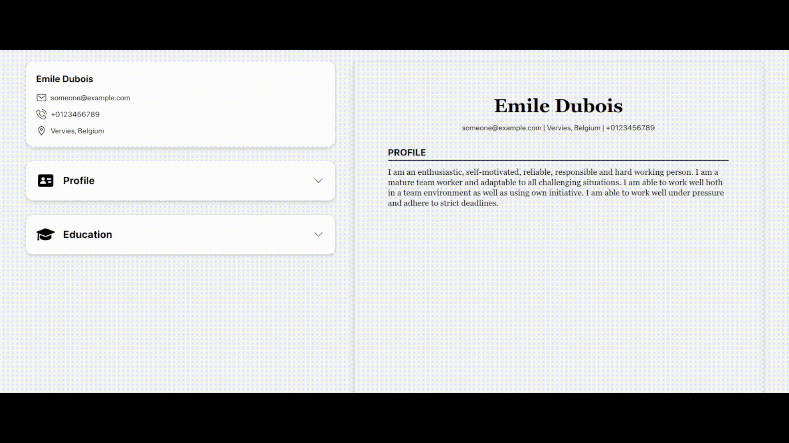

# CV Application

This is a web application that allows users to create and preview their resumes in a user-friendly manner. It is built with React, TypeScript and Tailwind, and it was created as a project for The Odin Project curriculum.

## Features

- Users can fill in their personal information, such as name, job title, contact details, and address.
- Users can also provide a summary of their work experience, education, and skills.
- The application has a preview feature that allows users to see how their resumes would look like when printed or shared.
- The application is responsive and mobile-friendly.

## How to Run the Application

To run this application on your local machine, follow these steps:

1. Clone this repository to your local machine.
2. Install the dependencies by running `npm install`.
3. Run the application by running `npm start`.
4. Access the application in your web browser at <http://localhost:3000>.

## Dependencies

This project was built with the following dependencies:

- [React](https://reactjs.org/)
- [TypeScript](https://www.typescriptlang.org/)
- [Tailwind CSS](https://tailwindcss.com/)
- [Vite](https://vitejs.dev/)

## Acknowledgments

This project was created as part of [The Odin Project](https://www.theodinproject.com/) curriculum. Special thanks to [FlowCV](https://flowcv.com/) for providing design inspiration for this project.
